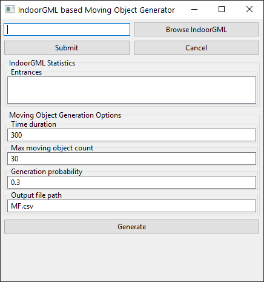

[](LICENSE)

# SIMOGen - Synthetic Indoor Moving Objects Generator

This project generate trajectory data for moving objects in indoor spaces.

## Getting Started
The follwing tools are required to build OpenGDS/Conversion:
* Java Development Kit 8 (JDK 8)
* [Apache Maven 3.x](https://maven.apache.org/download.cgi)

```
1. clone this project
2. mvn install -DskipTests
3. java -jar ui/SIMOGen.jar
```

## Usage

1) Push "Browse IndoorGML" button
    ```
    For using this program, input IndoorGML data should have 'USAGE' information in the description of 'State'
    'USAGE' should be one of those tags as below: 
    - Entrance
    - Room
    - Door
    - Corridor
    * In this program, at least one entrance is necessary because all the moving object moving starts from the entrance. 
    ```
2) Select IndoorGML data file
3) Push "Submit" button 
4) Set moving object generation parameters
    ```
    - Time duration (sec)
    - Maximum moving object count
    - Moving object generation probability
    - Output file (CSV) path
    ``` 
5) Push "Generate" button 
    ```
   The output format is as below:
   --> MovingFeature ID | Start Time | End Time | Start Coordinate | End Coordiante | TypeCode (Role)
   ```

